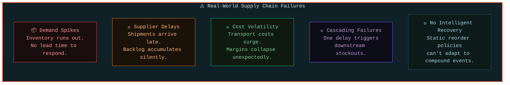
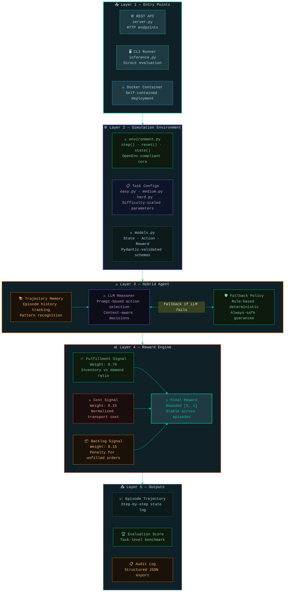
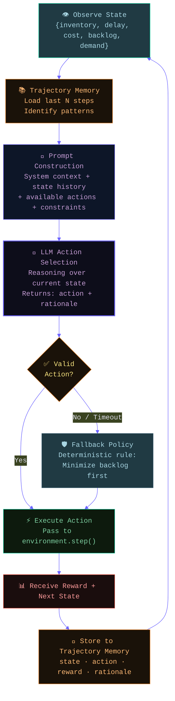
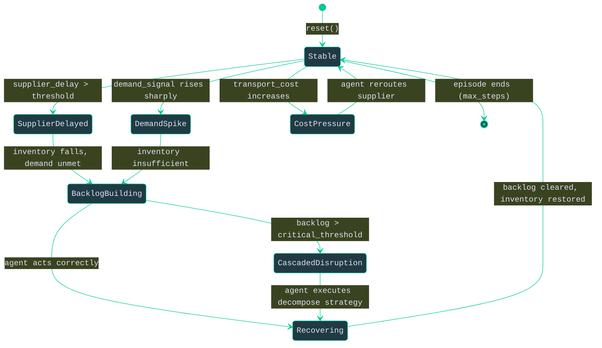
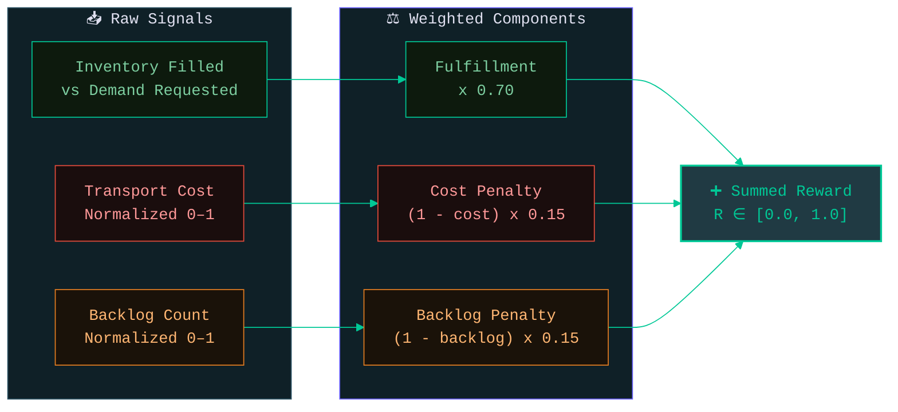
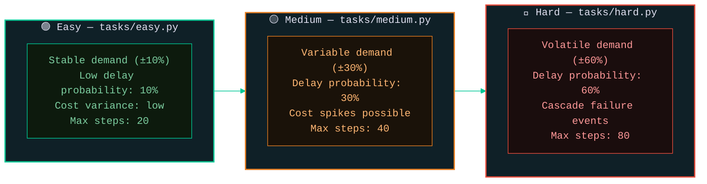

<div align="center">


<br/>

<a href="#">
  
</a>
<a href="#">
  
</a>
<a href="#">
  
</a>
<a href="#">
  
</a>
<a href="#">
  
</a>
<a href="#">
  
</a>

<br/><br/>


&nbsp;

&nbsp;

&nbsp;


</div>

<br/>

---

## 📌 Table of Contents

| | Section | | Section |
|---|---------|---|---------|
| 1 | [Overview](#-overview) | 2 | [Problem Statement](#-problem-statement) |
| 3 | [Solution](#-solution) | 4 | [System Architecture](#-system-architecture) |
| 5 | [Agent Architecture](#-agent-architecture) | 6 | [Environment Dynamics](#-environment-dynamics) |
| 7 | [State & Action Spaces](#-state--action-spaces) | 8 | [Reward Function](#-reward-function) |
| 9 | [API Specification](#-api-specification) | 10 | [Multi-Task Evaluation](#-multi-task-evaluation) |
| 11 | [Sample Output](#-sample-output) | 12 | [Project Structure](#-project-structure) |
| 13 | [Quick Start](#-quick-start) | 14 | [Docker Setup](#-docker-setup) |
| 15 | [HuggingFace Deployment](#-huggingface-deployment) | 16 | [Key Innovations](#-key-innovations) |

---

## 🧭 Overview

**OpenEnv Supply Chain Disruption Simulator** is a production-grade, OpenEnv-compliant reinforcement learning environment where an AI agent learns to optimize supply chain operations under real-world uncertainty.

The agent observes inventory levels, supplier delays, transport costs, backlog pressure, and demand signals — then acts to minimize exposure and maximize order fulfillment through a hybrid LLM + fallback policy.

> Designed for benchmarking, hackathon evaluation, and deployment on Hugging Face Spaces or any Docker host.

---

## ❓ Problem Statement

Modern supply chains are fragile. Enterprises operate across dozens of suppliers, shipping corridors, and demand zones — each carrying probabilistic failure modes that compound under stress.



| # | Challenge | Business Impact |
|---|-----------|----------------|
| 📦 | Demand signal uncertainty | Stockout events, lost revenue |
| 🚢 | Supplier delay propagation | Order backlog, SLA breaches |
| 💸 | Transport cost volatility | Margin erosion, budget overrun |
| 🔁 | Cascaded disruption effects | Entire fulfillment pipeline blocked |
| 🤖 | Static, non-adaptive policies | No recovery without human escalation |

---

## 💡 Solution

This project delivers a **closed-loop simulation environment** where an AI agent can be trained, evaluated, and benchmarked on realistic supply chain disruption scenarios.

```mermaid
%%{init: {'theme': 'base', 'themeVariables': {'primaryColor': '#203a43', 'primaryTextColor': '#E0E0F0', 'primaryBorderColor': '#00C896', 'lineColor': '#00C896', 'background': '#0f2027', 'mainBkg': '#203a43', 'clusterBkg': '#0f2027', 'titleColor': '#E0E0F0', 'fontFamily': 'monospace'}}}%%
flowchart TD
    CORE(["🧠 Three Design Pillars"])

    subgraph PILLARS [""]
        direction LR
        P1["⚙️ OpenEnv-Compliant\nStandardized step/reset/state API\nCompatible with any RL framework"]
        P2["🤖 Hybrid Agent\nLLM reasoning + deterministic fallback\nTrajectory memory across steps"]
        P3["📊 Stable Rewards\nBounded 0–1 normalized signal\nNon-collapsing across all episodes"]
    end

    CORE --> PILLARS

    style CORE fill:#00C896,stroke:#2c5364,stroke-width:2px,color:#0f2027
    style P1 fill:#0d1a0d,stroke:#00C896,color:#7DCEA0
    style P2 fill:#0d0d1a,stroke:#6C63FF,color:#C39BD3
    style P3 fill:#0d1a1a,stroke:#2c5364,color:#A8D5E2
    style PILLARS fill:#0f2027,stroke:#00C896,stroke-width:1px,color:#E0E0F0
```

---

## 🏗️ System Architecture



---

## 🤖 Agent Architecture



---

## 🌊 Environment Dynamics



---

## 🔲 State & Action Spaces

### State Space

```python
state = {
    "inventory":       int,    # Current units in stock
    "supplier_delay":  int,    # Periods of delay from supplier (0 = on time)
    "transport_cost":  float,  # Normalized cost [0.0, 1.0]
    "backlog":         int,    # Unfulfilled orders pending
    "demand_signal":   int     # Forecast demand for next period
}
```

| Field | Type | Range | Description |
|-------|------|-------|-------------|
| `inventory` | `int` | `[0, max_inv]` | Available stock units |
| `supplier_delay` | `int` | `[0, 10]` | Periods supplier is delayed |
| `transport_cost` | `float` | `[0.0, 1.0]` | Normalized cost signal |
| `backlog` | `int` | `[0, ∞)` | Orders not yet fulfilled |
| `demand_signal` | `int` | `[0, max_demand]` | Incoming demand forecast |

### Action Space

| Action | ID | Description | Primary Use Case |
|--------|----|-------------|-----------------|
| `reroute` | `0` | Switch to alternate transport route | High transport cost |
| `change_supplier` | `1` | Switch to backup supplier | High supplier delay |
| `increase_inventory` | `2` | Place emergency stock order | Low inventory + high demand |
| `delay_orders` | `3` | Defer outbound orders temporarily | Reduce backlog pressure |

---

## 📐 Reward Function

$$R = 0.70 \times \text{fulfillment} + 0.15 \times (1 - \text{cost}) + 0.15 \times (1 - \text{backlog\_norm})$$



**Reward Design Constraints:**

| Property | Implementation |
|----------|---------------|
| **Bounded** | All components normalized to [0, 1] before weighting |
| **Non-collapsing** | Minimum possible reward is 0.0, never negative |
| **Stable** | Consistent signal across episode lengths and task difficulties |
| **Interpretable** | Each component independently meaningful to business outcomes |

---

## 🌐 API Specification

The environment exposes a standard OpenEnv HTTP API via `server.py`.

### Endpoints

| Method | Endpoint | Description |
|--------|----------|-------------|
| `POST` | `/reset` | Initialize or restart environment episode |
| `POST` | `/step` | Execute one action, receive next state + reward |
| `GET` | `/state` | Fetch current environment state |
| `GET` | `/health` | Liveness check |

### `/reset`

```http
POST /reset
Content-Type: application/json

{
  "task": "medium",
  "seed": 42
}
```

**Response:**
```json
{
  "state": {
    "inventory": 120,
    "supplier_delay": 2,
    "transport_cost": 0.45,
    "backlog": 10,
    "demand_signal": 95
  },
  "episode_id": "ep_20240408_001"
}
```

### `/step`

```http
POST /step
Content-Type: application/json

{
  "action": "increase_inventory"
}
```

**Response:**
```json
{
  "state": {
    "inventory": 200,
    "supplier_delay": 2,
    "transport_cost": 0.44,
    "backlog": 5,
    "demand_signal": 100
  },
  "reward": 0.812,
  "done": false,
  "info": {
    "fulfillment": 0.95,
    "cost_component": 0.083,
    "backlog_component": 0.129
  }
}
```

---

## 🎯 Multi-Task Evaluation

Three benchmark difficulty tiers with progressively larger state perturbations and uncertainty:



| Task | Demand Variance | Delay Probability | Cascade Events | Target Reward |
|------|----------------|-------------------|----------------|---------------|
| **Easy** | ±10% | 10% | No | ≥ 0.85 |
| **Medium** | ±30% | 30% | Occasional | ≥ 0.70 |
| **Hard** | ±60% | 60% | Yes | ≥ 0.55 |

---

## 📋 Sample Output

```
══════════════════════════════════════════════════════════════
  OpenEnv Supply Chain Simulator  |  Task: medium  |  Seed: 42
══════════════════════════════════════════════════════════════

Episode Starting...
────────────────────────────────────────────────────────────

[Step 01] State: inv=120 | delay=2 | cost=0.45 | backlog=10 | demand=95
          Agent:  increase_inventory  (LLM)
          Reason: "Inventory below demand signal with active delay. Preemptive restock."
          Reward: 0.791

[Step 02] State: inv=200 | delay=2 | cost=0.44 | backlog=5  | demand=100
          Agent:  reroute             (LLM)
          Reason: "Cost holding steady. Delay persists. Reroute reduces downstream risk."
          Reward: 0.834

[Step 03] State: inv=180 | delay=0 | cost=0.61 | backlog=2  | demand=105
          Agent:  change_supplier     (FALLBACK)
          Reason: Cost spike detected, fallback policy triggered.
          Reward: 0.762

[Step 04] State: inv=160 | delay=1 | cost=0.38 | backlog=0  | demand=98
          Agent:  increase_inventory  (LLM)
          Reason: "Backlog cleared. Restock to buffer against demand signal."
          Reward: 0.901

────────────────────────────────────────────────────────────
Episode Complete  |  Steps: 40  |  Mean Reward: 0.814
Fulfillment Rate: 94.2%  |  Avg Cost: 0.46  |  Peak Backlog: 10
══════════════════════════════════════════════════════════════
```

---

## 📁 Project Structure

```
openenv-supply-chain-simulator/
│
├── agent/
│   └── llm_agent.py          # Hybrid LLM + fallback policy agent
│
├── memory/
│   └── trajectory.py         # Episode memory — stores state/action/reward history
│
├── tasks/
│   ├── easy.py               # Low-variance, low-delay scenario config
│   ├── medium.py             # Moderate disruption task parameters
│   └── hard.py               # High-volatility, cascade-enabled scenario
│
├── environment.py            # OpenEnv-compliant core (step / reset / state)
├── server.py                 # FastAPI REST server exposing OpenEnv endpoints
├── inference.py              # CLI evaluation runner with deterministic seed support
├── models.py                 # Pydantic schemas: State, Action, Reward, Episode
│
├── openenv.yaml              # OpenEnv manifest and environment metadata
├── Dockerfile                # Container build for reproducible deployment
├── requirements.txt          # Python dependencies
└── README.md
```

---

## ⚡ Quick Start

```bash
# 1. Clone the repository
git clone https://github.com/your-username/openenv-supply-chain-simulator.git
cd openenv-supply-chain-simulator

# 2. Create and activate virtual environment
python -m venv venv
source venv/bin/activate          # macOS / Linux
venv\Scripts\activate             # Windows

# 3. Install dependencies
pip install -r requirements.txt

# 4. Set your LLM API key (if using LLM agent)
export OPENAI_API_KEY="sk-..."    # or Anthropic key

# 5. Run a quick evaluation on the medium task
python inference.py --task medium --seed 42

# 6. Or start the REST API server
python server.py
# → API running at http://localhost:8000
```

**One-line demo (easy task, no LLM — fallback policy only):**
```bash
python inference.py --task easy --agent fallback --seed 0
```

---

## 🐳 Docker Setup

```bash
# Build the image
docker build -t openenv-supply-chain .

# Run the container (API mode)
docker run -p 8000:8000 \
  -e OPENAI_API_KEY="sk-..." \
  openenv-supply-chain

# Run single evaluation (CLI mode)
docker run --rm \
  -e OPENAI_API_KEY="sk-..." \
  openenv-supply-chain \
  python inference.py --task hard --seed 7
```

**`Dockerfile` excerpt:**

```dockerfile
FROM python:3.10-slim
WORKDIR /app
COPY requirements.txt .
RUN pip install --no-cache-dir -r requirements.txt
COPY . .
EXPOSE 8000
CMD ["python", "server.py"]
```

---

## 🤗 HuggingFace Deployment

Deploy to Hugging Face Spaces in minutes:

```bash
# 1. Install HF CLI
pip install huggingface_hub

# 2. Login
huggingface-cli login

# 3. Create a new Space (Docker SDK)
huggingface-cli repo create openenv-supply-chain --type space --space_sdk docker

# 4. Push repository
git remote add hf https://huggingface.co/spaces/your-username/openenv-supply-chain
git push hf main
```

Add your API key as a **Space Secret** under Settings → Variables and Secrets → `OPENAI_API_KEY`.

The Space will auto-build via `Dockerfile` and expose the REST API publicly.

---

## 🆚 Why This Stands Out

| Capability | This Project | Typical RL Env |
|------------|-------------|----------------|
| **API Standard** | OpenEnv-compliant (step/reset/state) | Custom, non-portable |
| **Agent Design** | Hybrid LLM + fallback — no silent failures | Single policy only |
| **Reward Signal** | Bounded, normalized, non-collapsing | Often unbounded or unstable |
| **Reproducibility** | Deterministic inference via seed | Stochastic, not reproducible |
| **Difficulty Tiers** | 3 structured tasks (easy/medium/hard) | Single-difficulty only |
| **Memory** | Trajectory memory across episode steps | Stateless per step |
| **Deployment** | Docker + HuggingFace Spaces ready | Local only |
| **Auditability** | Structured JSON logs per episode | No output logging |

---

## 💡 Key Innovations

**1. OpenEnv Compliance**
Fully standardized `step()`, `reset()`, and `state()` interface means this environment is portable across any OpenEnv-compatible evaluation harness with zero modification.

**2. Hybrid Agent with Fallback Guarantee**
The LLM reasoner provides interpretable, context-aware actions. When it fails (timeout, invalid output, API error), the deterministic fallback policy activates instantly — the agent never blocks or crashes.

**3. Stable Reward Shaping**
The three-component reward formula is designed with normalization constraints that prevent collapse at episode boundaries, making it suitable for policy gradient and value-based methods without reward clipping hacks.

**4. Trajectory Memory**
Each episode accumulates step history in `trajectory.py`, enabling the LLM to reason over time-series context rather than acting on a single snapshot — a meaningful leap over standard Markov-assumption environments.

**5. Multi-Task Benchmark Protocol**
Three rigorously parameterized difficulty tiers allow reproducible comparison across models, policies, and training regimes — making results from this environment directly publishable as evaluation benchmarks.

---

## 🏁 Conclusion

**OpenEnv Supply Chain Disruption Simulator** is a complete, production-grade benchmark environment for decision-making agents under real-world uncertainty. It combines a standards-compliant OpenEnv interface, a hybrid LLM agent with reliability guarantees, a stable reward function, and Docker-native deployment — all in a single, portable repository.

It is built to be benchmarked, deployed, extended, and trusted.

---

<div align="center">


<br/>

**Built for OpenEnv Hackathon — Agentic Systems Track**

<br/>

*Optimized for uncertainty. Designed for reliability.*

</div>
